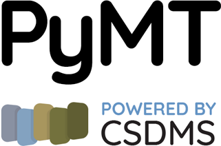

PyMT is the "Python Modeling Toolkit". It is an Open Source Python
package, developed by the Community Surface Dynamics Modeling System,
that provides the necessary tools used for the coupling of models
that expose the Basic Modeling Interface (BMI).

PyMT in three points:

* Tools for coupling models of disparate time and space scales
* A collection of Earth-surface models
* Extensible plug-in framework for adding new models

What does it look like?  Here is an example of a simple PyMT program:

.. code-block:: python

    from pymt.components import Cem, Waves

    waves = Waves()
    cem = Cem()

    waves.initialize(*waves.setup())
    cem.initialize(*cem.setup())

    for time in range(1000):
        waves.update()
        angle = waves.get_value("wave_angle")
        cem.set_value("wave_angle", angle)
        cem.update()

.. toctree::
   :maxdepth: 2
   :caption: Contents:

   readme
   installation
   usage
   modules
   contributing
   authors
   history

Indices and tables
==================
* :ref:`genindex`
* :ref:`modindex`
* :ref:`search`
