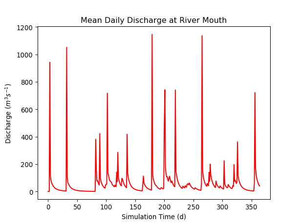

Quickstart
==========

Here's the fast path to using *pymt*.
If you want to dig deeper,
links are provided at each step to more detailed information elsewhere.

Install conda
-------------

`Anaconda`_ is a free, open-source, Python distribution
that contains a comprehensive set of packages for scientific computing.
If you don't have conda installed, the `Anaconda installation guide`_
can help you through the process.

.. _Anaconda: https://www.anaconda.com/distribution/
.. _Anaconda installation guide: http://docs.anaconda.com/anaconda/install/

Install *pymt*
--------------

Once you've installed conda,
You can get *pymt* directly from `conda-forge`_:

.. code-block:: bash

  $ conda install pymt -c conda-forge 

Installing into a :doc:`conda environment<conda-environments>`
is strongly recommended.
Check the :doc:`installation guide<installation>`
for more detailed information about installing *pymt*.

.. _conda-forge: https://conda-forge.org/

.. _install-a-model:

Install a model
---------------

`Hydrotrend`_ is a hydrological water balance and transport model
that simulates water discharge and sediment load at a river outlet.
It's also one of the models available in *pymt*.
Install Hydrotrend into *pymt* with:

.. code-block:: console

    $ conda install pymt_hydrotrend -c conda-forge

Check that the model has been installed by starting a Python
session and importing *pymt*:

.. code-block:: python

    >>> import pymt
    => models: Hydrotrend

Keep this Python session open;
we'll use it for the examples that follow.

.. _Hydrotrend: https://csdms.colorado.edu/wiki/Model:HydroTrend

.. _run-a-model:

Run a model
-----------

Now that Hydrotrend has been installed into *pymt*,
import it into your Python session and create an `instance`_:

.. code-block:: python

  >>> from pymt.models import Hydrotrend
  >>> model = Hydrotrend()

To run a model,
*pymt* expects a model `configuration file`_.
Get the default configuration for Hydrotrend:

.. code-block:: python

  >>> cfg_file, cfg_dir = model.setup()

Start the model, setting its initial conditions,
by calling its *initialize* `method`_:

.. code-block:: python

  >>> model.initialize(cfg_file, cfg_dir)

The model is now ready to run.
For reference, show the current time in the model.

.. code-block:: python

  >>> model.get_current_time()
  0.0

Now call the *update* method to advance the model
by a single time step:

.. code-block:: python

  >>> model.update()
  >>> model.get_current_time()
  1.0

What units are associated with this time step?
(Picoseconds? `Parsecs`_?)
Find out with the *get_time_units* method:

.. code-block:: python

  >>> model.get_time_units()
  'd'

The Hydrotrend model exposes a set of output variables,
as shown by the *get_output_var_names* method:

.. code-block:: python

  >>> for var in model.get_output_var_names():
  ...     print(var)
  ...
  atmosphere_bottom_air__domain_mean_of_temperature
  channel_exit_water_sediment~suspended__mass_flow_rate
  channel_exit_water_flow__speed
  channel_entrance_water_sediment~bedload__mass_flow_rate
  channel_exit_water__volume_flow_rate
  channel_exit_water_x-section__width
  channel_exit_water_x-section__depth
  channel_entrance_water__volume_flow_rate
  atmosphere_water__domain_mean_of_precipitation_leq-volume_flux
  channel_exit_water_sediment~bedload__mass_flow_rate
  channel_exit_water_sediment~suspended__mass_concentration

With the *get_value* method,
find the current value of the mean water discharge at the river mouth
through its descriptive `CSDMS Standard Name`_:

.. code-block:: python

  >>> model.get_value('channel_exit_water__volume_flow_rate')
  array([ 1.1])

What units are attached to this discharge value?
Find out with the *get_var_units* method:

.. code-block:: python

  >>> model.get_var_units('channel_exit_water__volume_flow_rate')
  'm^3 / s'

Run the model to completion,
storing the discharge values for future use:

.. code-block:: python

  >>> import numpy as np
  >>> n_steps = int(model.get_end_time() / model.get_time_step())
  >>> discharge = np.empty(n_steps)
  >>> for i in range(n_steps):
  ...     discharge[i] = model.get_value('channel_exit_water__volume_flow_rate')
  ...     model.update()

Complete the model run by calling the *finalize* method:

.. code-block:: python

  >>> model.finalize()

.. _instance: https://en.wikipedia.org/wiki/Instance_(computer_science)
.. _configuration file: https://en.wikipedia.org/wiki/Configuration_file
.. _method: https://en.wikipedia.org/wiki/Method_(computer_programming)
.. _Parsecs: https://www.esquire.com/entertainment/movies/a20967903/solo-star-wars-kessel-distance-plot-hole/
.. _CSDMS Standard Name: https://csdms.colorado.edu/wiki/CSDMS_Standard_Names

View results
------------

Let's plot the daily mean water discharge values generated by the model.
Start by importing Python's `matplotlib`_ library,
used for generating a `variety`_ of publication-quality figures:

.. code-block:: python

  >>> import matplotlib.pyplot as plt

Then set up a line plot of the discharge values:

.. code-block:: python

  >>> plt.plot(discharge, 'b')

Nothing appears on the screen yet; this statement only
configures the plot.
However, a plot isn't complete until it has appropriate labels.
Add some with:

.. code-block:: python

  >>> plt.title('Mean Daily Discharge at River Mouth')
  >>> plt.xlabel('Simulation Time (d)')
  >>> plt.ylabel('Discharge ($m^3 s^{-1}$)')

Now display the plot:

.. code-block:: python

  >>> plt.show()

A more detailed example of using Hydrotrend 
can be found in the :doc:`demos/hydrotrend`
Jupyter Notebook.
An expanded description of the *pymt* methods used in this example
can be found in the :doc:`usage` section.

.. _matplotlib: https://matplotlib.org
.. _variety: https://matplotlib.org/gallery/index.html
